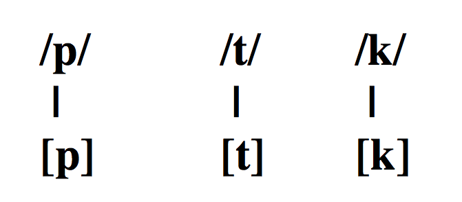

```{r setup, include=FALSE}
options(htmltools.dir.version = FALSE)
```

class: middle, center

.large[
|           |            |                 |          |          |            |
| :-------- | :--------- | :-------------- | :------- | :------- | :--------- |
| Media     | Lateral    | Oclusiva        | Media    | Nasal    | Media      |
| Anterior  | Fricativa  | Velar           | Anterior | Alveolar | Posterior  |
| Estirada  | Alveolar   | Sorda           | Estirada | Sonora   | Redondeada |
| .white[.] |            |                 |          |          |            |
| Fricativa | Media      | Vibrante simple | Baja     | Nasal    | Media      |
| Palatal   | Posterior  | Alveolar        | Central  | Alveolar | Posterior  |
| Sonora    | Redondeada | Sonora          |          | Sonora   | Redondeada |
| .white[.] |            |                 |          |          |            |
| Nasal     | Baja       | Nasal           | Baja     |          |            |
| Bilabial  | Central    | Bilabial        | Central  |          |            |
| Sonora    |            | Sonora          |          |          |            |
]

--
.footnote[
.big[/el.ke.no.ˈʝo.ɾa.no.ˈma.ma/]
]

---
class: title-slide-section-grey, middle

# Las oclusivas sordas

---
background-image: url(./assets/img/aparatofonador.png)
background-position: 90% 50%

# Los fonemas oclusivos sordos

### /p, t, k/

--

- /p/: oclusivo, **bilabial**, sordo

- /t/: oclusivo, **dental**, sordo

- /k/: oclusivo, **velar**, sordo

---

# Los fonemas oclusivos sordos

--

- Representan tres fonemas distintos

- ¿Cómo lo sabemos? Podemos formar pares mínimos

</br>

| Principio de palabra |              |     | Interior de palabra |              |
| :------------------- | :----------- | :-- | :------------------ | :----------- |
| **p**asa             | /ˈ**p**a.sa/ |     | se**p**a            | /ˈse**.p**a/ |
| **t**aza             | /ˈ**t**a.sa/ |     | ze**t**a            | /ˈse**.t**a/ |
| **c**asa             | /ˈ**k**a.sa/ |     | se**c**a            | /ˈse**.k**a/ |


---

# Los fonemas oclusivos sordos

--

### Cada fonema cuenta con un alófono

<div align="center">
  
</div>

---
background-image: url(../assets/img/cry.png)
background-size: 350px
background-position: 93% 40%

## Los fonemas oclusivos sordos

#### ¿Qué dificultades puede tener el hablante de alemán? 
#### ¿Qué tiene que hacer para no tener un acento extranjero en español?

- En inglés los oclusivos sordos se aspiran
  - Tiene que aprender a **evitar la aspiracion**

- La /t/ es un sonido **alveolar** en inglés y alemán, mientras que es .blue[dental] en 
español
  - Tiene que aprender a realizar un sonido que existe fonémicamente en su L1 
  de una manera distinta, eso es con un punto de articulación ***dental***

---

## Los fonemas oclusivos sordos

#### Ortografía

.big[
| Fonema |     Grafemas     |              Ejemplos              |
| :----- | :--------------- | :--------------------------------- |
| /p/    | 'p'              | '**P**aco'                         |
| /t/    | 't'              | '**t**aco'                         |
| /k/    | 'c' (-a, -o , -u) | '**c**asa', '**c**osa', '**c**upo' |
|        | 'qu' (-e, -i)    | '**qu**e', '**qu**iso'             |
|        | 'k'              | '**k**ilo'                         |
|        | 'x'              | 'e**x**amen'                       |
]

---

## Los fonemas oclusivos sordos

#### Contexto fónico

.pull-left[
- Posición inicial de sílaba
	- 'paco' → [ˈ**p**a.ko], 'mapa' → [ˈma.**p**a]
	- 'taco' → [ˈ**t**a.ko], 'pata' → [ˈpa.**t**a]
	- 'caco' → [ˈ**k**a.ko], 'poca' → [ˈpo.**k**a]

- Posición final de sílaba (coda) (comunmente eledidas)
	- 'apto' → [a**p**.to]
	- 'atlas' → [a**t**.las]
	- 'examen' → [e**k**.ˈsa.men] o [e.ˈsa.men]
]

.pull-right[
- No aparecen (con mucha frecuencia) en posicón final de palabra (comunmente eledidas)
	- 'kétchu**p**', 'argo**t**', 'biste**c**'
]

---
class: middle
background-color: black

**Enemigo \#2**

#### Ejercicios

---
background-image: url(./assets/img/wind.png)
background-size: contain 
background-color: black

---

## Análisis acústico

#### En Praat...

- Con un/a compañer@ graba las siguientes palabras:

|    | Español | Inglés |
| :- | :-      | :-     |
| 1. | papa    | paper  |
| 2. | tata    | table  |
| 3. | caca    | kill   |
| 4. | chica   | church |
| 5. | mucho   | bunch  |

- ¿Qué diferencias notáis?
- ¿Cómo podemos dar cuenta de estas diferencias? ¿Alguna medida?

---

# Análisis acústico

### Las oclusivas sordas

- Si medimos el intervalo de tiempo entre la explosión y el comienzo de la 
fonación de la siguiente vocal, podemos dar cuenta de las diferencias entre 
el inglés y el español

- Esta medida se llama *voice-onset time* (VOT) o *tiempo de inicio de sonoridad*

- Las oclusivas sordas del español tiene VOT corto

- Las oclusivas sordas del inglés/alemán tiene VOT largo

- Suena diferente una [p] con VOT corto con respecto a una [p] con VOT largo? 
¿Qué es lo que se oye?

- **Medid el VOT de vuestras [p] (español e inglés) y apuntad el valor en 
milisegundos**. Cuando hayáis terminado, decidme los valores. 

---
class: middle

```{r, echo=FALSE, fig.retina=2, fig.width=14, fig.align='center', message=FALSE}
library(tidyverse)

vot_data <- tribble(
  ~'participante', ~'phon', ~'vot_es', ~'vot_in', 
   'ENIDYAJ',       'p',      34,        38,
   'ENIDYAJ',       't',      58,        94,
   'ENIDYAJ',       'k',      45,        124,
   'LESLY',         'p',      10,        110,
   'LESLY',         't',      19,        106,
   'LESLY',         'k',      35,        91,
   'Joseph',        'p',       8,        27,
   'Joseph',        't',      10,        39,
   'Joseph',        'k',      13,        70,
   'CAROLINE',      'p',      12,        25,
   'CAROLINE',      't',      12,        23,
   'CAROLINE',      'k',      12,        16,
   'KELSEY',        'p',      31,        67,
   'KELSEY',        't',      26,        118,
   'KELSEY',        'k',      22,        78,
   'JO',            'p',      14,        27,
   'JO',            't',      17,        49,
   'JO',            'k',      15,        44,
   'CHRISTINA',     'p',       4,        47,
   'CHRISTINA',     't',       7,        60,
   'CHRISTINA',     'k',       4,        70,
   'ALEXA',         'p',      10,        200, 
   'ALEXA',         't',      60,        70, 
   'ALEXA',         'k',      40,        50, 
   'SUSANA',        'p',      13,        131,
   'SUSANA',        't',      53,        161,
   'SUSANA',        'k',      37,        40, 
   'HAMAIL',        'p',      23,        158, 
   'HAMAIL',        't',      21,        128, 
   'HAMAIL',        'k',      39,        110, 
   'JEREMY',        'p',      18,        78, 
   'JEREMY',        't',      18,        52, 
   'JEREMY',        'k',      15,        59, 
   'ELVIS',         'p',      20,        20, 
   'ELVIS',         't',       4,        90, 
   'ELVIS',         'k',       9,       130, 
   'ANGELICA',      'p',      8,        104, 
   'ANGELICA',      't',      10,        41, 
   'ANGELICA',      'k',      6,        98, 
   ) %>% 
  gather(., lang, vot, -participante, -phon)

vot_data %>% 
  filter(phon == "p") %>% 
  ggplot(., aes(x = lang, y = vot, fill = lang)) + 
    geom_point(size = 3, pch = 21) + 
    #ggrepel::geom_text_repel(aes(label = participante), size = 6, 
    #                         position = position_nudge(x = -0.1)) + 
    stat_summary(fun.data = mean_cl_boot, geom = "pointrange", pch = 21, 
                 size = 2, stroke = 1, position = position_nudge(x = 0.15)) + 
    scale_fill_brewer(palette = "Set1", guide = F) + 
    scale_x_discrete(labels = c("Español", "Inglés")) + 
    labs(title = "Oclusivas sordas", 
      subtitle = "VOT de /p/ en inglés y español", 
      y = "VOT (ms)", x = "Lengua", caption = "Promedio +/- 95% CI") + 
    coord_flip() + 
    theme_minimal(base_size = 20, base_family = 'Times')

```

---
class: middle

```{r, echo=FALSE, fig.retina=2, fig.width=14, fig.align='center', message=FALSE}
vot_data %>% 
  filter(phon == "t") %>% 
  ggplot(., aes(x = lang, y = vot, fill = lang)) + 
    geom_point(size = 3, pch = 21) + 
    #ggrepel::geom_text_repel(aes(label = participante), size = 6, 
    #                         position = position_nudge(x = -0.1)) + 
    stat_summary(fun.data = mean_cl_boot, geom = "pointrange", pch = 21, 
                 size = 2, stroke = 1, position = position_nudge(x = 0.15)) + 
    scale_fill_brewer(palette = "Set1", guide = F) + 
    scale_x_discrete(labels = c("Español", "Inglés")) + 
    labs(title = "Oclusivas sordas", 
      subtitle = "VOT de /t/ en inglés y español", 
      y = "VOT (ms)", x = "Lengua", caption = "Promedio +/- 95% CI") + 
    coord_flip() + 
    theme_minimal(base_size = 20, base_family = 'Times')

```

---
class: middle

```{r, echo=FALSE, fig.retina=2, fig.width=14, fig.align='center', message=FALSE}
vot_data %>% 
  filter(phon == "k") %>% 
  ggplot(., aes(x = lang, y = vot, fill = lang)) + 
    geom_point(size = 3, pch = 21) + 
    #ggrepel::geom_text_repel(aes(label = participante), size = 6, 
    #                         position = position_nudge(x = -0.1)) + 
    stat_summary(fun.data = mean_cl_boot, geom = "pointrange", pch = 21, 
                 size = 2, stroke = 1, position = position_nudge(x = 0.15)) + 
    scale_fill_brewer(palette = "Set1", guide = F) + 
    scale_x_discrete(labels = c("Español", "Inglés")) + 
    labs(title = "Oclusivas sordas", 
      subtitle = "VOT de /k/ en inglés y español", 
      y = "VOT (ms)", x = "Lengua", caption = "Promedio +/- 95% CI") + 
    coord_flip() + 
    theme_minimal(base_size = 20, base_family = 'Times')

```

---
class: middle

```{r, echo=FALSE, fig.retina=2, fig.width=14, fig.align='center', message=FALSE}

vot_data %>% 
  mutate(phon = forcats::fct_relevel(phon, "p", "t")) %>% 
  ggplot(., aes(x = lang, y = vot, fill = lang)) + 
    facet_grid(. ~ phon) + 
    geom_point(size = 3, pch = 21) + 
    #ggrepel::geom_text_repel(aes(label = participante), size = 6, 
    #                         position = position_nudge(x = -0.1)) + 
    stat_summary(fun.data = mean_cl_boot, geom = "pointrange", pch = 21, 
                 size = 2, stroke = 1, position = position_nudge(x = 0.15)) + 
    scale_fill_brewer(palette = "Set1", guide = F) + 
    scale_x_discrete(labels = c("Español", "Inglés")) + 
    labs(title = "Oclusivas sordas", 
      subtitle = "VOT de /p, t, k/ en inglés y español", 
      y = "VOT (ms)", x = "Lengua", caption = "Promedio +/- 95% CI") + 
    coord_flip() + 
    theme_minimal(base_size = 20, base_family = 'Times')
```

---
background-image: url(./assets/img/sp_en_stops.png)
background-size: contain 

---
background-image: url(./assets/img/sp_en_stops.png)
background-size: 760px
background-position: 52% 3%
class: bottom
--

<br><br>

```{r, echo=F, fig.retina=2, fig.width=11.5, fig.height=4.5, fig.align='center', message=F, warning=F}

vot_means <- vot_data %>% group_by(lang) %>% summarize(vot = mean(vot))

sigmoid_text <- tibble(
  vot = c(pull(vot_means[1, 2]), pull(vot_means[2, 2])), y = c(-0.03, 0.03), 
  lang = c("Español", "Inglés")
)

vot_data %>% 
  ggplot(., aes(x = vot, fill = lang)) + 
    geom_vline(xintercept = 0, lty = 3, color = "grey70") + 
    geom_hline(yintercept = 0, lty = 3) + 
    geom_density(data = filter(vot_data, lang == "vot_in"), show.legend = F) + 
    geom_density(data = filter(vot_data, lang == "vot_es"), show.legend = F, 
                 aes(x = vot, y = -(..density..))) + 
    scale_fill_brewer(name = NULL, palette = "Set1") + 
    scale_color_brewer(name = NULL, palette = "Set1") + 
    coord_cartesian(xlim = c(-140, 140), ylim = c(-0.04, 0.04)) + 
    labs(x = "VOT (ms)", y = NULL) + 
    scale_y_continuous(labels = NULL) + 
    scale_x_continuous(
      breaks = seq(-140, 140, 10), 
      labels = c("-140", " ", " ", " ", " ", " ", " ", " ", " ", " ", " ", 
                 " ", " ", " ", "0", " ", " ", " ", " ", " ", " ", " ", " ", 
                 " ", " ", " ", " ", " ", "140")) + 
    geom_text(data = sigmoid_text, 
              aes(x = vot, y = y, label = lang, fill = lang), 
              hjust = 0, show.legend = F, size = 7, family = "Times") +
    theme_minimal(base_size = 22, base_family = 'Times') + 
    theme(panel.grid.major = element_line(colour = 'grey90', size = 0.15),
          panel.grid.minor = element_blank())
```
