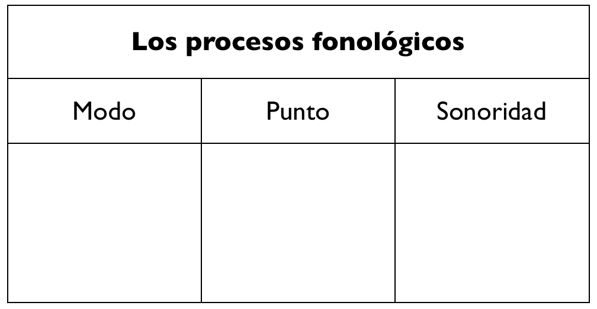
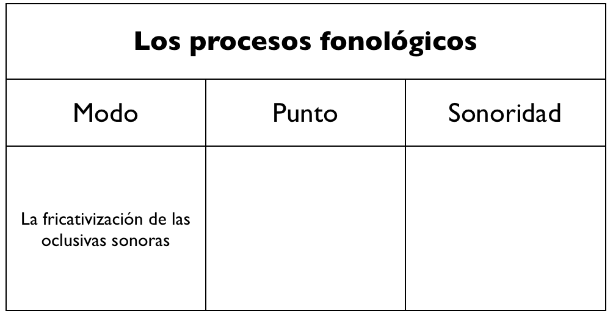
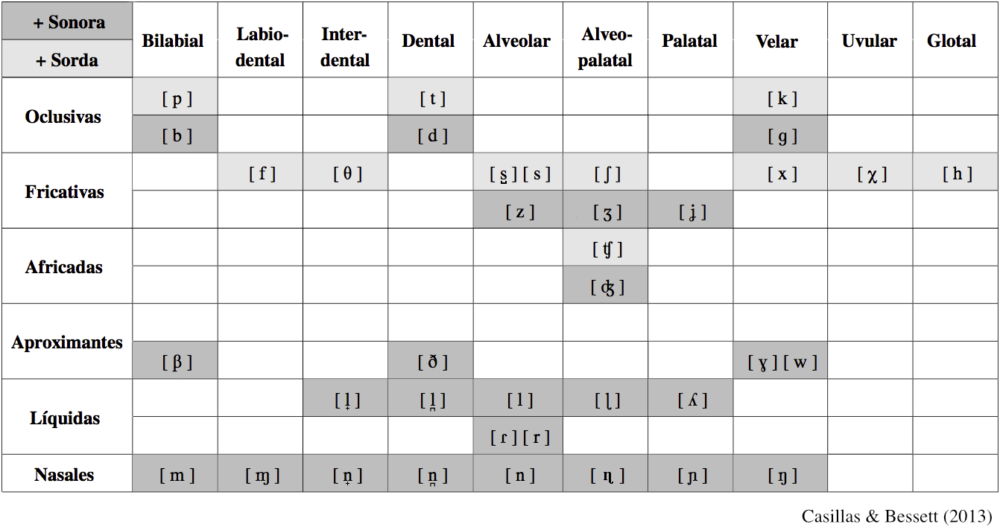

```{r setup, include=FALSE}
options(htmltools.dir.version = FALSE)
```

class: title-slide-section-grey, middle

# Repaso

---
background-image: url(https://raw.githubusercontent.com/jvcasillas/media/master/teaching/gifs/partner.gif)
background-size: 400px
background-position: 95% 50%

# Repaso

.pull-left[

### /f, x/

- ¿Cuáles son los problemas de pronunciación que presentan estos dos fonemas para el no nativo?
- ¿Presentan algún otro tipo de problema?

### La sonorización

- ¿Qué es el proceso de sonorización?
- ¿Cuáles son los sonidos afectados?
- Con un compañero pensad en 3 ejemplos relevantes.

]

---
class: title-slide-section-grey, middle

# Más procesos de asimilación

---
background-color: black
class: middle
background-image: url(./assets/img/nasales1.jpg)
background-size: 300px
background-position: 95% 20%

</br>

# Las nasales

---
background-image: url(./assets/img/nasales2.png)
background-size: 400px
background-position: 95% 20%

# Los fonemas nasales

- /m/: nasal, **bilabial**, sonora
- /n/: nasal, **alveolar**, sonora
- /ɲ/: nasal, **palatal**, sonora

---

# Los fonemas nasales

### Son fonemas, hay pares mínimos

</br>

|    Principio de palabra    |                                        |     |    Interior de palabra     |                                        |
| :------------------------- | :------------------------------------- | :-- | :------------------------- | :------------------------------------- |
| **m**apa/**n**apa/**ñ**apa | /ˈ**m**a.pa/ /ˈ**n**a.pa/ /ˈ**ɲ**a.pa/ |     | ca**m**a/ca**n**a/ca**ñ**a | /ˈka.**m**a/ /ˈka.**n**a/ /ˈka.**ɲ**a/ |

---

# Los fonemas nasales

### ¡Los fonemas /n/ y /m/ tienen en total 7<sup>*</sup> alófonos! 

.footnote[\* Las variedades peninsulares suelen tener 8]

---
background-image: url(./assets/img/n.png)
background-size: 750px
background-position: 50% 75%

# Los fonemas nasales

### ¡Los fonemas /n/ y /m/ tienen en total 7<sup>*</sup> alófonos! 

---
background-image: url(./assets/img/nALL.png)
background-size: 650px
background-position: 50% 75%

# Los fonemas nasales

### ¡Los fonemas /n/ y /m/ tienen en total 7<sup>*</sup> alófonos! 

---

# Las nasales

### La asimilación de las nasales

- Otro tipo de asimilación regresiva

- Cualquier nasal en posición de coda asimila el punto de articulación de la consonante que le sigue

### Ejemplos

- "Un barco"

---

# La asimilación de las nasales

### "Un barco"

- /uN.ˈbaɾ.ko/ → [um.ˈbaɾ.ko]

</br>

- El punto de articulación de la consonante /b/ es bilabial. 
- La nasal /n/ asimila el punto de articulación y es realizada como una 
nasal bilabial [m].

---

# La asimilación nasal

### Ejemplos

| Alófono |    Contexto    |     |    Ejemplo     |           Transcripción fonética           |
| :------ | :------------- | :-: | :------------- | :----------------------------------------- |
| [m]     | C bilabial     |  →  | "un barco"     | [u**m.ˈb**aɾ.ko]                           |
| [ɱ]     | C labiodental  |  →  | "en Finlandia" | [e**ɱ.f**in.ˈlan̪.di̯a]                    |
| [n̟]     | C interdental  |  →  | "un cielo"     | [u**n̟.ˈθ**i̯e.lo]                         |
| [n̪]     | C dental       |  →  | "en Finlandia" | [eɱ.fin.ˈla**n̪.d**i̯a]                    |
| [n]     | C alveolar     |  →  | "ansiedad"     | [a**n.s**i̯e.ˈðað]                         |
| [ɳ]     | C alveopalatal |  →  | "ancho"        | [ˈa**ɳ.ʧ**o]                               |
| [ɲ]     | C palatal      |  →  | "inyección"    | [i**ɲ.ʝ**ek.ˈθi̯on] o [i**ɲ.dʒ**ek.ˈθi̯on] |
| [ŋ]     | C velar        |  →  | "tengo"        | [ˈte**ŋ.g**o]                              |

---

# Las nasales

<iframe width="1000" height="500" src="http://soundsofspeech.uiowa.edu/index.html#spanish" frameborder="0" allowfullscreen></iframe>

---

# La asimilación nasal

### Recordad

<p></p>

- Hay resilabificación cuando una nasal va seguida de una vocal (el encandenamiento)
  - 'con una' → [ko.nu.na]

<p></p>

- Una secuencia de dos nasales seguidas puede reducirse a una
  - 'inmediato' → [in.me.ˈdi̯a.to], [im.me.ˈdi̯a.to] o [i.me.ˈdi̯a.to]
  - 'gimnasio' → [xim.ˈna.si̯o], [xin.ˈna.si̯o] o [xi.ˈna.si̯o]

<!-- <div align='center'>
  
</div> -->

---
background-image: url(./assets/img/nasalsMB.jpg)
background-position: 95% 50%
background-size: 300px

# La asimilación nasal

### Pronunciación

.pull-left[

- En inglés hay asimilación en el interior de palabra, pero no entre palabras
  - 'pond' → [p<sup>h</sup>ɑnd]
  - 'pong' → [p<sup>h</sup>ɑŋ]
  - 'palm frawn' → [p<sup>h</sup>ɑ<BLUE>m</BLUE>.<BLUE>f</BLUE>ɹɑn] vs. \*~~[p<sup>h</sup>ɑɱ.fɹɑn]~~
- El angloparlante tiene que pronunciar las secuencias sin pausas y con asimilación
  - 'en fin' → [e**ɱ**.ˈ**f**i.n]
  - 'tan bien/también' → [ta**m**.ˈ**b**i̯en]

]

<!-- <div align='center'>
  
</div>
 -->

---

# A practicar

### Transcribid las siguientes frases (variedad latinoamericana)

- tengo diez dardos
- eran pobres y desamparados
- enfatizar lo bueno
- envilecer dando voces
- un garaje bien colocado

---

# A practicar

### Transcribid las siguientes frases (variedad latinoamericana)

- tengodiezdardos
- eranpobresydesamparados
- enfatizarlobueno
- envilecerdandovoces
- ungarajebiencolocado

---

# A practicar

### Transcribid las siguientes frases (variedad latinoamericana)

- /ˈteN.go.ˈdies.ˈdar.dos/
- /ˈe.ɾaN.ˈpo.bɾe.si.de.saN.pa.ˈɾa.dos/
- /eN.fa.ti.ˈsaɾ.lo.ˈbue.no/
- /eN.bi.le.ˈseɾ.ˈdaN.do.ˈbo.ses/
- /uN.ga.ˈɾa.xe.ˈbieN.ko.lo.ˈka.do/

---

# A practicar

### Transcribid las siguientes frases (variedad latinoamericana)

- /ˈteN.go.ˈdies.ˈdar.dos/  
  [ˈteŋ.go.ˈði̯ez.ˈðaɾ.ðos]
- /ˈe.ɾaN.ˈpo.bɾe.si.de.saN.pa.ˈɾa.dos/  
  [ˈe.ɾam.ˈpo.βɾe.si.ðe.sam.pa.ˈɾa.ðos]
- /eN.fa.ti.ˈsaɾ.lo.ˈbue.no/  
  [eɱ.fa.ti.ˈsaɾ.lo.ˈβu̯e.no]
- /eN.bi.le.ˈseɾ.ˈdaN.do.ˈbo.ses/  
  [em.bi.le.ˈseɾ.ˈðan̪.do.ˈβo.ses]
- /uN.ga.ˈɾa.xe.ˈbieN.ko.lo.ˈka.do/  
  [uŋ.ga.ˈɾa.xe.ˈβi̯eŋ.ko.lo.ˈka.ðo]

---

# Resumen

|    Fonema   |    Alófono    |    Punto     |    Ejemplo     |    Transcripción fonética   |
| :---------- | :------------ | :----------- | :------------- | :-------------------------- |
| /m/ inicial | [m] + vocal   | bilabial     | Mamá, cama     |                             |
| /n/ inicial | [n] + vocal   | alveolar     | Carne, nada    |                             |
| /ɲ/ inicial | [ɲ] + vocal   | palatal      | Caña, ñoña     |                             |

---

# Resumen

|    Fonema   |    Alófono      |    Punto     |    Ejemplo     |    Transcripción fonética   |
| :---------- | :-------------- | :----------- | :------------- | :-------------------------- |
| /m/ inicial | [m] + vocal     | bilabial     | Mamá, cama     |                             |
| /n/ inicial | [n] + vocal     | alveolar     | Carne, nada    |                             |
| /ɲ/ inicial | [ɲ] + vocal     | palatal      | Caña, ñoña     |                             |
| .white[.]   |                 |              |                |                             |
| .white[.]   |                 |              |                |                             |
|             | [m] + /p, b/    | bilabial     | "un barco"     | [u**m**.ˈ**b**ar.ko]        |
|             | [ɱ] + /f/       | labiodental  | "en Finlandia" | [e**ɱ**.**f**in.ˈlan̪.di̯a]   |
|             | [n̟] + /θ/       | interdental  | "en cielo"     | [u**n̟**.ˈ**θ**i̯e.lo]        |
| /N/ final   | [n̪] + /t ,d/    | dental       | "en Finlandia" | [eɱ.fin.ˈla**n̪**.**d**i̯a]   |
| de sílaba   | [n] + /s, l, r/ | alveolar     | "ansiedad"     | [a**n**.**s**i̯e.ˈðað]       |
|             | [ɳ] + /ʧ/       | alveopalatal | "ancho"        | [ˈa**ɳ**.**ʧ**o]            |
|             | [ɲ] + /ʝ, ɲ/    | palatal      | "inyección"    | [i**ɲ**.**ʝ**ek.ˈsi̯on]      |
|             | [ŋ] + /k, g, x/ | velar        | "tengo"        | [ˈte**ŋ**.**g**o]           |

---

# Resumen

### PARA LAS TRANSCRIPCIONES:

<p></p>

- Nasales al principio de sílaba/palabra:
  - sólo pueden ser 3: /m,n,ɲ/ → [m,n,ɲ]

<p></p>

- Nasales al final de sílaba (posición de coda) o palabra:
  - transcripción fonológica: ARCHIFONEMA /N/
  - transcripción fonética: el alófono que corresponda según el punto de 
  articulación de la siguiente consonante

---

# La tarea

- No contestes el teléfono si es para mí  
  /no.koN.ˈtes.te.seL.te.ˈle.fo.no.sies.ˈpa.ɾa.mi/  
  [no.kon̪.ˈtes.te.sel̪.te.ˈle.fo.no.si̯es.ˈpa.ɾa.mi]
- Al final sí encontré lo que me dijiste  
  /aL.fi.ˈnaL.ˈsi.eN.koN.ˈtɾe.lo.ke.me.di.ˈxis.te/  
  [al.fi.ˈnal.ˈsi.eŋ.kon̪.ˈtɾe.lo.ke.me.ði.ˈxis.te]
- La cámara de gas no fue un buen invento de la humanidad  
  /la.ˈka.ma.ɾa.de.gas.no.fueuN.bue.niN.ˈbeN.to.de.lau.ma.ni.ˈdad/  
  [la.ˈka.ma.ɾa.ðe.ɣaz.no.fu̯eu̯m.bu̯e.nim.ˈben̪.to.ðe.lau̯.ma.ni.ˈðað]

---


background-image: url(./assets/img/laterals1.gif)
background-position: 95% 20%
background-size: 300px
background-color: black
class: middle

</br></br></br></br></br></br></br>

# Las laterales

---

# Las laterales

### En general, sólo hay un fonema

- /l/: lateral, alveolar, sonora

---

# Las laterales

### Es un fonema, hay pares mínimos

</br>

| Principio de palabra |                           |     | Interior de palabra |                           |
| :------------------- | :------------------------ | :-- | :------------------ | :------------------------ |
| **l**ata/**p**ata    | /ˈ**l**a.ta/ /ˈ**p**a.ta/ |     | pa**l**a/pa**n**a   | /ˈpa.**l**a/ /ˈpa.**n**a/ |

---

# Las laterales

<!-- <div style="float:right">
  
</div> -->

### En general, sólo hay un fonema

- /l/: lateral, alveolar, sonora

### Pero algunas variedades cuentan con otro...

- /ʎ/: lateral, **palatal**, sonora

---

# Las laterales

### Son fonemas, hay pares mínimos

</br>

|     Principio de palabra    |                                       |     |     Interior de palabra     |                                        |
| :-------------------------- | :------------------------------------ | :-- | :-------------------------- | :------------------------------------- |
| **l**ama/**ll**ama/**m**ama | /ˈ**l**a.ma/ /ˈ**ʎ**a.ma/ /ˈ**m**a.ma |     | ca**l**a/ca**ll**a/ca**m**a | /ˈka.**l**a/ /ˈka.**ʎ**a/ /ˈka.**m**a/ |

---

# Las laterales

### La asimilación de las laterales

- En posición de coda, la lateral asume el punto de articulación de la consonante siguiente en algunos casos...

### Ejemplos

| Alófono |    Contexto    |     |  Ejemplo   | Transcripción fonética |
| :------ | :------------- | :-: | :--------- | :--------------------- |
| [l̟]     | C interdental  |  →  | "alce"     | [ˈa**l̟.θ**e]          |
| [l̪]     | C dental       |  →  | "saldo"    | [ˈsa**l̪.d**o]         |
| [l]     | C alveolar     |  →  | "al salir" | [a**l.s**a.ˈliɾ]       |
| [ɭ]     | C alveopalatal |  →  | "colchón"  | [ko**ɭ.ˈʧ**on]         |
| [ʎ]     | C palatal      |  →  | "el yate"  | [e**ʎ.ˈʝ**a.te]        |

---

# Las laterales

<iframe width="1000" height="500" src="http://soundsofspeech.uiowa.edu/index.html#spanish" frameborder="0" allowfullscreen></iframe>

---

# Las laterales

### No hay laterales...

- bilabiales
- labiodentales
- velares

### Cuando una lateral va seguida de una consonante bilabial, </br>labiodental o velar se realiza como [l]. 

### ¿Por qué?

--

- Intentad hacer una lateral bilabial o labiodental
- ¿y la velar?

---

# Las laterales

### Existen laterales velares, pero no forman parte del español estándar

</br>

|      Inglés      | Transcripción | Español | Transcripción |
| :--------------- | :------------ | :------ | :------------ |
| .blue[[ɬ]]       |               | **[l]** |               |
| Al               | [æɬ]          | al      | [al]          |
| mill             | [mɪɬ]         | mil     | [mil]         |
| total            | [ˈt<sup>h</sup>o.ɾɬ]  | total   | [to.ˈtal]     |

---

# Transcribid (variedad peninsular estándar)

- Ellos no tienen que ganar un sueldo más alto para mejorar su nivel de vida.  
- La fonética es difícil y no me gusta para nada.  
- El cielo está muy gris durante esta temporada  
- El chófer era borde con los clientes  
- No compres el hielo  

---

# Transcribid (variedad peninsular estándar)

- Ellos no tienen que ganar un sueldo más alto para mejorar su nivel de vida.  
  /ˈe.ʝos.no.ˈtie.neN.ke.ga.ˈna.ɾuN.ˈsueL.do.ma.ˈsaL.to.pa.ɾa.me.xo.ˈɾaɾ.su.ni.ˈbeL.de.ˈbi.da/  
  [ˈe.ʝoz.no.ˈti̯e.neŋ.ke.ɣa.ˈna.ɾun.ˈsu̯el̪.do.ma.ˈsal̪.to.pa.ɾa.me.xo.ˈɾaɾ.su.ni.ˈβel̪.de.ˈβi.ða]
- La fonética es difícil y no me gusta para nada.  
  /la.fo.ˈne.ti.ka.es.di.ˈfi.θi.li.no.me.ˈgus.ta.pa.ɾa.na.da/  
  [la.fo.ˈne.ti.ka.ez.ði.ˈfi.θi.li.no.me.ˈɣus.ta.pa.ɾa.na.ða]  
- El cielo está muy gris durante esta temporada  
  /eL.ˈθie.lo.es.ˈta.mui.ˈgɾis.du.ˈɾaN.teːs.ta.teN.po.ˈɾa.da/  
  [el̟.ˈθi̯e.lo.es.ˈta.mui̯.ˈɣɾiz.ðu.ˈɾan̪.teːs.ta.tem.po.ˈɾa.ða]
- El chófer era borde con los clientes  
  /eL.ˈʧo.fe.ɾe.ɾa.ˈboɾ.de.koN.los.ˈkli.eN.tes/  
  [eɭ.ˈʧo.fe.ɾe.ɾa.ˈβoɾ.ðe.kon.los.ˈkli.en̪.tes]
- No compres el hielo  
  /no.ˈkoN.pɾe.seL.ˈʝe.lo/  
  [no.ˈkom.pɾe.seʎ.ˈʝe.lo]

---

# Las laterales

<div align='center'>
  
</div>

---

# Las laterales

<div align='center'>
  
</div>

---

# Las laterales

<div align='center'>
  
</div>

---

# Las laterales

<div align='center'>
  
</div>

---

# Los fonemas con un alófono

### ¿Cuáles son los fonemas con solamente un alófono?

- /p/, /t/ y /k/
- /ʧ/
- /ɾ/ y /r/
- /f/ y /x/
- /ɲ/

---

</br>

<div align='center'>
  
</div>

---

# Pruebita - Contesta las siguientes preguntas...

1. Descripción articulatoria: [β, θ, ð, dʒ, ɱ]
2. Explique el proceso de sonorización. Dé un ejemplo.
3. Describa los problemas (de pronunciación y de ortografía) que presentan las 
fricativas /f, x/. Dé ejemplos relevantes.

???

1. [β]: fricativo, bilabial, sonoro; [θ]: fricativo, interdental, sordo; [ð]: frivativo, dental, sonoro; [dʒ]: africado, alveopalatal, sonoro; [ɱ]: nasal, labiodental, sonoro
2. La sonorización es el proceso por el cual el sonido fricativo alveolar sordo adquiere el rasgo +sonoro ([z]) cuando se encuentra antes de una consonante sonora (ej. 'mismo' [ˈmiz.mo]).
3. Las fricativas /f, x/ no presentan problemas de pronunciación para el no nativo. Con respecto a la ortografía, el fonema /x/ no tiene correspondencia exclusiva, por lo que puede confundirse con la 'g' y la 'j' (ej. 'gitano' [xi.ˈta.no] vs. 'gente' [ˈxen̪.te]).


```{r eval=FALSE, echo=FALSE}
rmarkdown::render("./static/slides/12_vibrantes_entonacion/index.Rmd")
xaringan::inf_mr()
```

# Fito

<iframe width="1000" height="400" src="https://www.youtube.com/embed/DgGOz9-KFuc?controls=0" frameborder="0" allowfullscreen></iframe>

---

# Fito

### Buscad...

1. Tres ejemplos de sonorización
2. Tres ejemplos de fricitivización
3. Tres ejemplos en los que la fricativización se bloquee 
debido a la presencia de una nasal
4. Una nasal dental
5. Una nasal velar
6. Una nasal interdental
7. Una lateral interdental

.footnote[
Las letras están disponibles [aquí](https://www.jvcasillas.com/ru_teaching/ru_spanish_362/362_03_s2019/slides/12_vibrantes_entonacion/assets/img/fito2/fito2.pdf)
]

---
class: title-slide-section-grey, middle

# Las vibrantes (cont.)

---

# Las vibrantes

<div style="float:right">
  
</div>

### Hay 2 fonemas vibrantes del español

- /ɾ/: vibrante simple, alveolar, sonora
- /r/: vibrante múltiple, alveolar, sonora

---

# Las vibrantes

- Son fonemas en posición intervocálica
- Hay pares mínimos

</br>

|     |   Palabra    |       Transcripción       |
| --- | :----------- | :------------------------ |
|     | 'coro/corro' | /ˈko.**ɾ**o/ /ˈko.**r**o/ |
|     | 'pero/perro' | /ˈpe.**ɾ**o/ /ˈpe.**r**o/ |
|     | 'caro/carro' | /ˈka.**ɾ**o/ /ˈka.**r**o/ |

---

# Las vibrantes

### Cada fonema tiene un alófono

</br>

<div align='center'>
  
</div>

---

# Las vibrantes

### ¡OJO!

- En otras posiciones no hay distinción fonémica
- Se trata de un fonema con dos alófonos

</br>

<div align='center'>
  
</div>

---

# Las vibrantes - Distribución de alófonos...

### [ɾ]

- En un <BLUE>ataque complejo</BLUE> (ataque compuesto de dos consonantes)
  - 'broma' [ˈb<BLUE>ɾ</BLUE>o.ma]
  - 'tren' [t<BLUE>ɾ</BLUE>en]
  - 'dragón' [d<BLUE>ɾ</BLUE>a.ˈɣon]

---

# Las vibrantes - Distribución de alófonos...

### [r]

- A principio de palabra
  - 'rosa' [ˈ**r**o.sa]
  - 'rojo' [ˈ**r**o.xo]
  - 'roto' [ˈ**r**o.to]
- A principio de sílaba después de /l/, /n/ o /s/
  - 'alrededor' [al.**r**e.ðe.ˈðoɾ]
  - 'Enrique' [en.ˈ**r**i.ke]
  - 'Israel' [is.**r**a.ˈel]

---

# Las vibrantes - Distribución de alófonos...

### [ɾ] / \[r]  (opcional)

- En posición de coda, o posición enfática
  - 'dar' [da<BLUE>ɾ</BLUE>]/[da**r**]
  - 'harto' [a<BLUE>ɾ</BLUE>.to]/[a**r**.to]
  - 'hace un calorrr' [ka.ˈlo<BLUE>ɾ</BLUE>]/[ka.ˈlo**r**]

---

# Las vibrantes - Pronunciación

### /r/ inglés (/ɚ, ɝ, ɹ)

- Es una aproximante ('aproximant')
- La lengua no toca los alvéolos
- La punta de la lengua se vuelve hacia atrás ('retroflex')

### /ɾ/ español

- Se aproxima más al sonido de 'Peter', 'pretty', 'ladder'

### /r/ español

- Como el ruido que hacen los niños cuando juegan a los 'GI Joes'

---

# GI Joe

<iframe width="420" height="315" src="https://www.youtube.com/embed/u8g1D7OFhBY" frameborder="0" allowfullscreen></iframe>

---

# Las vibrantes

<iframe width="1200" height="500" src="http://soundsofspeech.uiowa.edu/index.html#spanish" frameborder="0" allowfullscreen></iframe>

---

# El efecto Bernoulli

<iframe width="420" height="315" src="https://www.youtube.com/embed/wzL2d1jODzk" frameborder="0" allowfullscreen></iframe>

---

# El efecto Bernoulli

<iframe width="560" height="315" src="https://www.youtube.com/embed/YfAAL1l8HqA" frameborder="0" allowfullscreen></iframe>

---
background-color: black
class: middle

<div align="right">
  
</div>

## Enemigo \#4 - Las vibrantes

# Ejercicios

---


<!--
# La entonación

-

## La entonación

- .segue bg:grey
-->

# Práctica

---

## Transcribid

- Un cubano canoso cuenta la caña con cuidado
- Concepción Núñez de Los Ángeles tiene un pato nombrado Chencho Núñez.
- Con que te vas inmediatamente a la cabaña para no tener que nadar. 
- El niño Angélico está enfermo. 
- Era un año antes de la independencia del país. 
- Un gringo me mandó un folleto. 
- Muchos de los meʝores estudiantes se esforzaron para poder hacerlo cuanto antes.  

---

## Transcribid

- Uncubanocanosocuentalacañaconcuidado
- ConcepciónNúñezdeLosÁngelestieneunpatonombradoChenchoNúñez.
- Conquetevasinmediatamentealacabañaparanotenerquenadar. 
- ElniñoAngélicoestáenfermo. 
- Eraunañoantesdelaindependenciadelpaís. 
- Ungringomemandóunfolleto. 
- Muchosdelosmeʝoresestudiantesseesforzaronparapoderhacerlocuantoantes

---

## Transcribid

- /uN.ku.ˈba.no.ka.ˈno.so.ˈkueN.ta.la.ˈka.ɲa.koN.kui.ˈda.do/
- /koN.sep.ˈsio.ˈnu.ɲes.de.lo.ˈsaN.xe.les.ˈtie.ˈneuN.ˈpa.to.noN.ˈbɾa.do.ˈʧeN.ʧo.ˈnu.ɲes/
- /koN.ke.te.ˈba.siN.me.dia.ta.ˈmeN.te.a.la.ka.ˈba.ɲa.pa.ɾa.no.te.ˈneɾ.ke.na.ˈdaɾ/
- /el.ˈni.ɲo.aN.ˈxe.li.ko.es.ˈta.eN.ˈfeɾ.mo/
- /ˈe.ɾau.ˈna.ɲo.ˈaN.tes.de.laiN.de.peN.ˈdeN.sia.del.pa.ˈis/
- /uN.ˈgɾiN.go.me.maN.ˈdouN.fo.ˈʝe.to/
- /ˈmu.ʧos.de.los.me.ˈxo.ɾe.ses.tu.ˈdiaN.te.se:s.foɾ.ˈθa.ɾoN.pa.ɾa.po.ˈde.ɾa.ˈθeɾ.lo.kuan.to.an.tes/

---

## Transcribid

- /uN.ku.ˈba.no.ka.ˈno.so.ˈkueN.ta.la.ˈka.ɲa.koN.kui.ˈda.do/  
  [uŋ.ku.ˈβa.no.ka.ˈno.so.ˈku̯en̪.ta.la.ˈka.ɲa.koŋ.ku̯i.ˈða.ðo]
- /koN.sep.ˈsio.ˈnu.ɲes.de.lo.ˈsaN.xe.les.ˈtie.ˈneuN.ˈpa.to.noN.ˈbɾa.do.ˈʧeN.ʧo.ˈnu.ɲes/  
  [kon.sep.ˈsi̯o.ˈnu.ɲez.ðe.lo.ˈsaŋ.xe.les.ˈti̯e.ˈneu̯m.ˈpa.to.nom.ˈbɾa.ðo.ˈʧeɳ.ʧo.ˈnu.ɲes]
- /koN.ke.te.ˈba.siN.me.dia.ta.ˈmeN.te.a.la.ka.ˈba.ɲa.pa.ɾa.no.te.ˈneɾ.ke.na.ˈdaɾ/  
  [koŋ.ke.te.ˈβa.sim.me.ði̯a.ta.ˈmen̪.te.a.la.ka.ˈβa.ɲa.pa.ɾa.no.te.ˈneɾ.ke.na.ˈðaɾ]
- /el.ˈni.ɲo.aN.ˈxe.li.ko.es.ˈta.eN.ˈfeɾ.mo/  
  [el.ˈni.ɲo.aŋ.ˈxe.li.ko.es.ˈta.eɱ.ˈfeɾ.mo]
- /ˈe.ɾau.ˈna.ɲo.ˈaN.tes.de.laiN.de.peN.ˈdeN.sia.del.pa.ˈis/  
  [ˈe.ɾaú̯.ˈna.ɲo.ˈan̪.tez.ðe.lai̯n̪.de.pen̪.ˈden.si̯a.ð el.pa.ˈis]
- /uN.ˈgɾiN.go.me.maN.ˈdouN.fo.ˈʝe.to/  
  [uŋ.ˈgɾiŋ.go.me.man̪.ˈdou̯ɱ.fo.ˈʝe.to]
- /ˈmu.ʧos.de.los.me.ˈxo.ɾe.ses.tu.ˈdiaN.te.se:s.foɾ.ˈθa.ɾoN.pa.ɾa.po.ˈde.ɾa.ˈθeɾ.lo.kuan.to.an.tes/  
  [ˈmu.ʧoz.ðe.loz.me.ˈxo.ɾe.ses.tu.ˈði̯an̪.te.se:s.foɾ.ˈθa.ɾom.pa.ɾa.po.ˈðe.ɾa.ˈθeɾ.lo.ku̯an̪.to.an̪.tes]  
  


